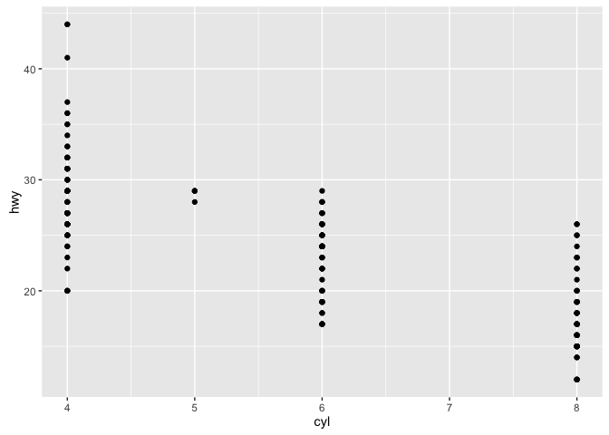
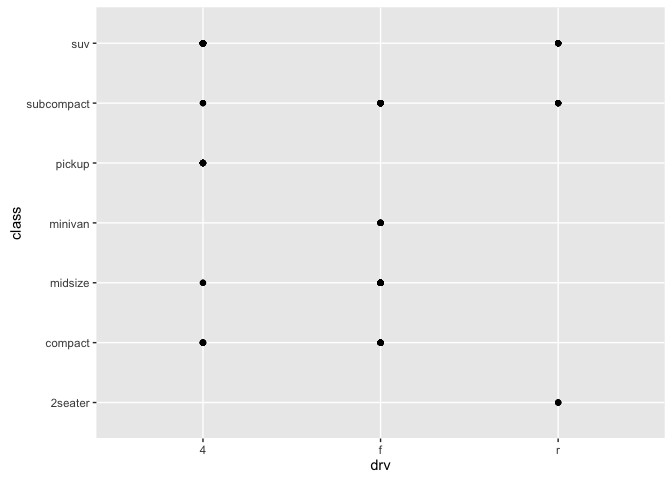
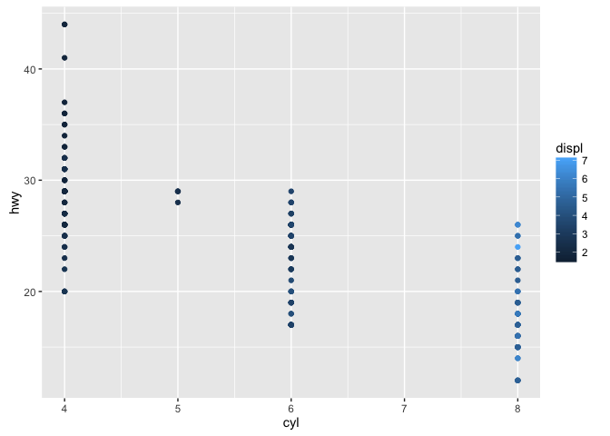
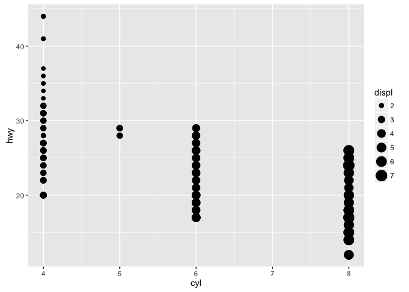
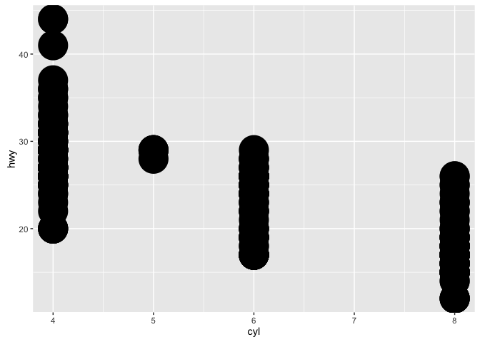
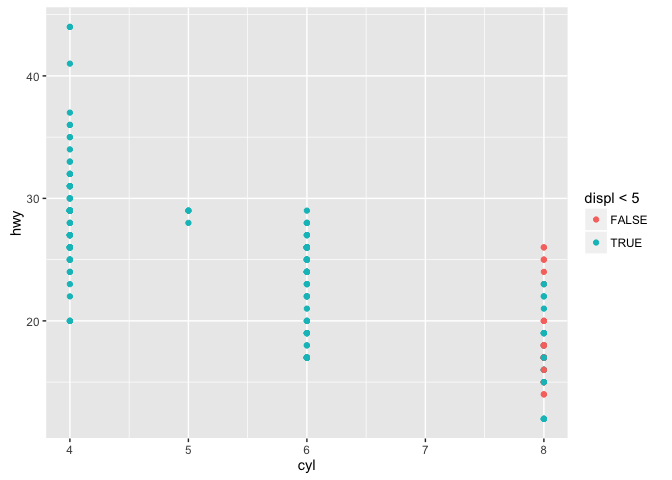
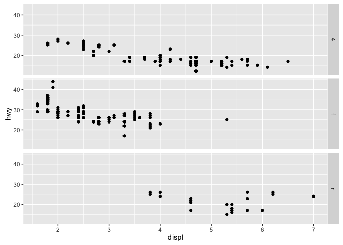
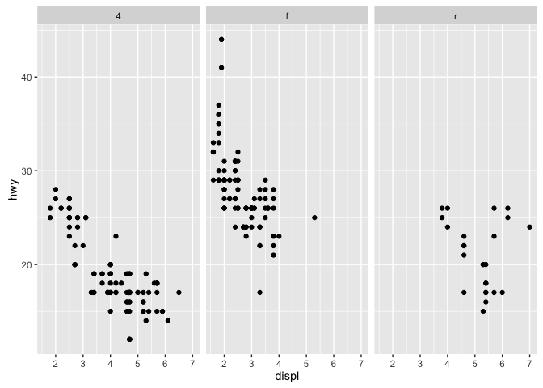
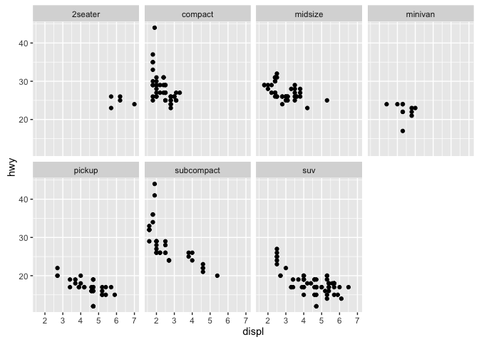

# Week 3.Benn


```r
library(tidyverse)
```

```
## Loading tidyverse: ggplot2
## Loading tidyverse: tibble
## Loading tidyverse: tidyr
## Loading tidyverse: readr
## Loading tidyverse: purrr
## Loading tidyverse: dplyr
```

```
## Conflicts with tidy packages ----------------------------------------------
```

```
## filter(): dplyr, stats
## lag():    dplyr, stats
```

##3.2.4 Exercises  
**1. Run ggplot(data = mpg) what do you see?  **

```r
ggplot(data = mpg)
```

<!-- -->

No plot is produced.  

**2. How many rows are in mtcars? How many columns?  **

```r
nrow(mtcars)
```

```
## [1] 32
```

```r
ncol(mtcars)
```

```
## [1] 11
```
 
**3.What does the drv variable describe? Read the help for ?mpg to find out.  **
drv describes whether the car is front, rear, or 4-wheel drive.  

**4. Make a scatterplot of hwy vs cyl. ** 

```r
ggplot(data=mpg) + geom_point(mapping = aes(x = cyl, y = hwy))
```

<!-- -->


**5. What happens if you make a scatterplot of class vs drv. Why is the plot not useful?  **

```r
ggplot(data=mpg) + geom_point(mapping = aes(x = drv, y = class))
```

<!-- -->

The graph basically shows that most drive types are represented in most classes.  

##3.3.1 Exercises  
**1. What’s gone wrong with this code? Why are the points not blue?  
The color assignment is within the aes(), so the code is trying to assign color based on a non-existant "blue " variable.  **

**2. Which variables in mpg are categorical? Which variables are continuous? (Hint: type ?mpg to read the documentation for the dataset). How can you see this information when you run mpg? ** 

Manufacturer, model, cyl, trans, drv, fl, and class are categorical. Displ, cty, and hwy are continuous. Some information is provided via the type of atomic vector - character vectors are certainly categorical, however integers may be categorical or continuous.  

**3. Map a continuous variable to color, size, and shape. How do these aesthetics behave differently for categorical vs. continuous variables?  **


```r
ggplot(data=mpg) + geom_point(mapping = aes(x = cyl, y = hwy, color = displ))
```

<!-- -->

```r
ggplot(data=mpg) + geom_point(mapping = aes(x = cyl, y = hwy, size = displ))
```

<!-- -->

```r
ggplot(data=mpg) + geom_point(mapping = aes(x = cyl, y = hwy, shape = displ))
```

```
## Error: A continuous variable can not be mapped to shape
```

<!-- -->

**4. What happens if you map the same variable to multiple aesthetics?  **

```r
ggplot(data=mpg) + geom_point(mapping = aes(x = cyl, y = hwy, color = displ, color = displ))
```

```
## Warning: The plyr::rename operation has created duplicates for the
## following name(s): (`colour`)
```

<!-- -->

**5. What does the stroke aesthetic do? What shapes does it work with? (Hint: use ?geom_point)  **

```r
ggplot(data=mpg) + geom_point(mapping = aes(x = cyl, y = hwy, stroke = 10))
```

<!-- -->

Stroke sets the border sizes of the points.

**6. What happens if you map an aesthetic to something other than a variable name, like aes(colour = displ < 5)?**


```r
ggplot(data=mpg) + geom_point(mapping = aes(x = cyl, y = hwy, colour = displ < 5))
```

<!-- -->

It essentially creates categories and maps the variable based on that.  

##3.5.1 Exercises
**1. What happens if you facet on a continuous variable?  **

```r
ggplot(data=mpg) + geom_point(mapping = aes(x = cyl, y = hwy))
```

<!-- -->

```r
+ facet_wrap(~displ, nrow = 2)
```

```
## Error in +facet_wrap(~displ, nrow = 2): invalid argument to unary operator
```
We get an error message!

**2. What do the empty cells in plot with facet_grid(drv ~ cyl) mean? How do they relate to this plot?**  

It indicates that no data corresponded to those categories - e.g. there were no rear-wheel drive cars with 5 cylinders. This corresponds to the missing points on the provided plot.

**3. What plots does the following code make? What does . do?**


```r
ggplot(data = mpg) + 
  geom_point(mapping = aes(x = displ, y = hwy)) +
  facet_grid(drv ~ .)
```

<!-- -->

```r
ggplot(data = mpg) + 
  geom_point(mapping = aes(x = displ, y = hwy)) +
  facet_grid(. ~ drv)
```

<!-- -->

The . is a placeholder for either the X or Y in the grid. In the first one drv, is arranged as rows, while in the second drv is in columns.  

**4. Take the first faceted plot in this section:  **


```r
ggplot(data = mpg) + 
  geom_point(mapping = aes(x = displ, y = hwy)) + 
  facet_wrap(~ class, nrow = 2)
```

<!-- -->

**What are the advantages to using faceting instead of the colour aesthetic? What are the disadvantages? How might the balance change if you had a larger dataset?  **

The advantage is being able to look more easily at distributions within each category of the faceting variable, while the disadvantage is that comparisons between categories become harder. I think both are worth looking at for most datasets.  

**5. Read ?facet_wrap. What does nrow do? What does ncol do? What other options control the layout of the individual panels? Why doesn’t facet_grid() have nrow and ncol variables?  **

ncol and nrow sets the number of columns and rows in the facet output. Facet_grid lacks these options, because it is outputting all combinations of the variables specified.  

**6. When using facet_grid() you should usually put the variable with more unique levels in the columns. Why?**

This will look better in a typically formatted page.
