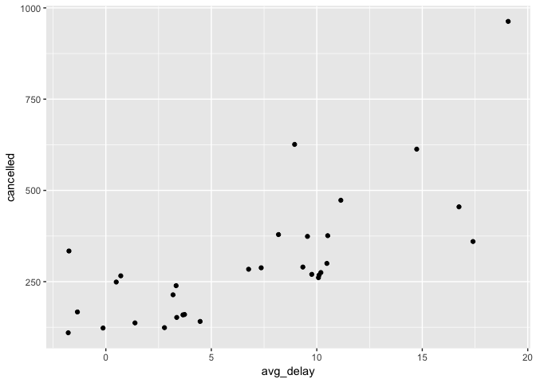
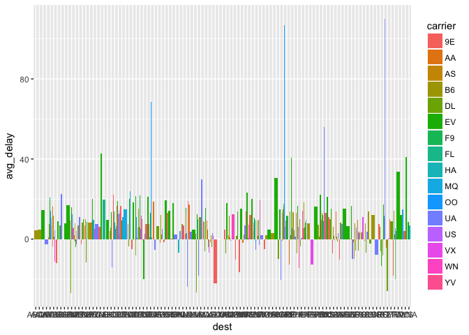
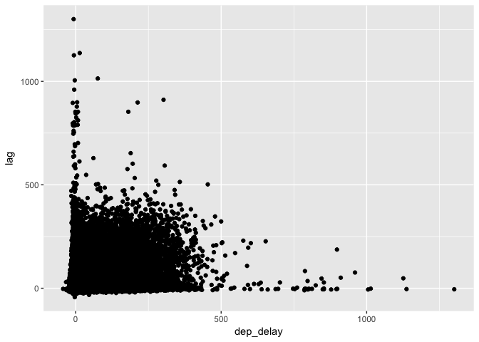

# Benn.R-club-May-17


```r
library(tidyverse)
```

```
## Loading tidyverse: ggplot2
## Loading tidyverse: tibble
## Loading tidyverse: tidyr
## Loading tidyverse: readr
## Loading tidyverse: purrr
## Loading tidyverse: dplyr
```

```
## Conflicts with tidy packages ----------------------------------------------
```

```
## filter(): dplyr, stats
## lag():    dplyr, stats
```

```r
library(nycflights13)
data <- flights
```


```r
sessionInfo()
```

```
## R version 3.3.2 (2016-10-31)
## Platform: x86_64-apple-darwin13.4.0 (64-bit)
## Running under: OS X El Capitan 10.11.6
## 
## locale:
## [1] en_US.UTF-8/en_US.UTF-8/en_US.UTF-8/C/en_US.UTF-8/en_US.UTF-8
## 
## attached base packages:
## [1] stats     graphics  grDevices utils     datasets  methods   base     
## 
## other attached packages:
## [1] nycflights13_0.2.2 dplyr_0.5.0        purrr_0.2.2       
## [4] readr_1.1.0        tidyr_0.6.1        tibble_1.3.0      
## [7] ggplot2_2.2.1      tidyverse_1.1.1   
## 
## loaded via a namespace (and not attached):
##  [1] Rcpp_0.12.10     cellranger_1.1.0 plyr_1.8.4       forcats_0.2.0   
##  [5] tools_3.3.2      digest_0.6.12    jsonlite_1.4     lubridate_1.6.0 
##  [9] evaluate_0.10    nlme_3.1-131     gtable_0.2.0     lattice_0.20-35 
## [13] psych_1.7.5      DBI_0.6-1        yaml_2.1.14      parallel_3.3.2  
## [17] haven_1.0.0      xml2_1.1.1       stringr_1.2.0    httr_1.2.1      
## [21] knitr_1.15.1     hms_0.3          rprojroot_1.2    grid_3.3.2      
## [25] R6_2.2.0         readxl_1.0.0     foreign_0.8-68   rmarkdown_1.5   
## [29] modelr_0.1.0     reshape2_1.4.2   magrittr_1.5     backports_1.0.5 
## [33] scales_0.4.1     htmltools_0.3.6  rvest_0.3.2      assertthat_0.2.0
## [37] mnormt_1.5-5     colorspace_1.3-2 stringi_1.1.5    lazyeval_0.2.0  
## [41] munsell_0.4.3    broom_0.4.2
```

##5.6.7 Exercises

**1. Brainstorm at least 5 different ways to assess the typical delay characteristics of a group of flights. Consider the following scenarios:**

A flight is 15 minutes early 50% of the time, and 15 minutes late 50% of the time.

A flight is always 10 minutes late.

A flight is 30 minutes early 50% of the time, and 30 minutes late 50% of the time.

99% of the time a flight is on time. 1% of the time it’s 2 hours late.

Which is more important: arrival delay or departure delay?


```r
not_cancelled <- flights %>%
  filter(!is.na(dep_delay), !is.na(arr_delay))
```
This question is kind of vague.

**2. Come up with another approach that will give you the same output as not_cancelled %>% count(dest) and not_cancelled %>% count(tailnum, wt = distance) (without using count()).**


```r
not_cancelled %>% 
  group_by(dest) %>%
  summarise(flights = n())
```

```
## # A tibble: 104 × 2
##     dest flights
##    <chr>   <int>
## 1    ABQ     254
## 2    ACK     264
## 3    ALB     418
## 4    ANC       8
## 5    ATL   16837
## 6    AUS    2411
## 7    AVL     261
## 8    BDL     412
## 9    BGR     358
## 10   BHM     269
## # ... with 94 more rows
```

```r
not_cancelled %>% 
  group_by(tailnum) %>%
  summarise(total = sum(distance))
```

```
## # A tibble: 4,037 × 2
##    tailnum  total
##      <chr>  <dbl>
## 1   D942DN   3418
## 2   N0EGMQ 239143
## 3   N10156 109664
## 4   N102UW  25722
## 5   N103US  24619
## 6   N104UW  24616
## 7   N10575 139903
## 8   N105UW  23618
## 9   N107US  21677
## 10  N108UW  32070
## # ... with 4,027 more rows
```

**3. Our definition of cancelled flights (is.na(dep_delay) | is.na(arr_delay) ) is slightly suboptimal. Why? Which is the most important column?**
It seems like we would only really care about the arr_delay - i.e. the flights that never made it. So we could dispense with asking about missing dep_delay information.

**4. Look at the number of cancelled flights per day. Is there a pattern? Is the proportion of cancelled flights related to the average delay?**


```r
flights %>%
  group_by(day) %>%
  summarise(
    flights = n(),
    cancelled = sum(is.na(arr_delay)),
    avg_delay = mean(arr_delay, na.rm = TRUE)
  ) %>%
  arrange(desc(cancelled)) %>%
  ggplot(aes(x = avg_delay, y = cancelled)) + geom_point()
```

<!-- -->

It looks like the number of cancelled flights is positively correlated with average delay. This makes sense - a storm or computer glitch that causes delays will also lead to cancellations.

**5. Which carrier has the worst delays? Challenge: can you disentangle the effects of bad airports vs. bad carriers? Why/why not? (Hint: think about flights %>% group_by(carrier, dest) %>% summarise(n()))**


```r
flights %>%
  group_by(carrier) %>%
  summarise(avg_delay = mean(arr_delay, na.rm = TRUE)) %>%
  arrange(desc(avg_delay))
```

```
## # A tibble: 16 × 2
##    carrier  avg_delay
##      <chr>      <dbl>
## 1       F9 21.9207048
## 2       FL 20.1159055
## 3       EV 15.7964311
## 4       YV 15.5569853
## 5       OO 11.9310345
## 6       MQ 10.7747334
## 7       WN  9.6491199
## 8       B6  9.4579733
## 9       9E  7.3796692
## 10      UA  3.5580111
## 11      US  2.1295951
## 12      VX  1.7644644
## 13      DL  1.6443409
## 14      AA  0.3642909
## 15      HA -6.9152047
## 16      AS -9.9308886
```

Frontier (F9) has the highest average delay.


```r
flights %>%
  group_by(carrier, dest) %>%
  summarise(avg_delay = mean(arr_delay, na.rm = TRUE)) %>%
  ggplot(aes(x = dest, y = avg_delay, fill = carrier)) + geom_bar(stat = "identity", position = "dodge")
```

```
## Warning: Removed 2 rows containing missing values (geom_bar).
```

<!-- -->
It seems like it's complicated because certain carriers utilizes specific airports more heavily. This could be addressed by using statistical approaches.

**6. What does the sort argument to count() do. When might you use it?**

It sorts the results of count from highest to lowest. I would probably use it as a default.

##5.7.1 Exercises

**1. Refer back to the lists of useful mutate and filtering functions. Describe how each operation changes when you combine it with grouping.**

**2. Which plane (tailnum) has the worst on-time record?**


```r
flights %>%
  group_by(tailnum) %>%
  summarise(mean_delay = mean(arr_delay, na.rm = TRUE)) %>%
  arrange(desc(mean_delay))
```

```
## # A tibble: 4,044 × 2
##    tailnum mean_delay
##      <chr>      <dbl>
## 1   N844MH   320.0000
## 2   N911DA   294.0000
## 3   N922EV   276.0000
## 4   N587NW   264.0000
## 5   N851NW   219.0000
## 6   N928DN   201.0000
## 7   N7715E   188.0000
## 8   N654UA   185.0000
## 9   N665MQ   174.6667
## 10  N427SW   157.0000
## # ... with 4,034 more rows
```

N844MH has the highest average delay.


```r
flights %>%
  group_by(tailnum) %>%
  filter(arr_delay > 0) %>%
  count(tailnum) %>%
  arrange(desc(n))
```

```
## # A tibble: 3,874 × 2
##    tailnum     n
##      <chr> <int>
## 1   N725MQ   215
## 2   N228JB   192
## 3   N258JB   191
## 4   N713MQ   185
## 5   N711MQ   184
## 6   N723MQ   180
## 7   N531MQ   174
## 8   N190JB   173
## 9   N353JB   173
## 10  N534MQ   172
## # ... with 3,864 more rows
```

N725MQ has the most delayed flights.


```r
flights %>%
  group_by(tailnum) %>%
  filter(arr_delay > 60) %>%
  count(tailnum) %>%
  arrange(desc(n))
```

```
## # A tibble: 3,371 × 2
##    tailnum     n
##      <chr> <int>
## 1   N10575    50
## 2   N15910    48
## 3   N15980    48
## 4   N16919    48
## 5   N228JB    46
## 6   N192JB    45
## 7   N258JB    45
## 8   N324JB    44
## 9   N13958    43
## 10  N14573    43
## # ... with 3,361 more rows
```

N10575 has the most flights delayed an hour or more.

**3. What time of day should you fly if you want to avoid delays as much as possible?**

```r
data %>%
  group_by(hour) %>%
  summarise(mean_delay = mean(arr_delay, na.rm = TRUE)) %>%
  arrange(mean_delay)
```

```
## # A tibble: 20 × 2
##     hour mean_delay
##    <dbl>      <dbl>
## 1      7 -5.3044716
## 2      5 -4.7969072
## 3      6 -3.3844854
## 4      9 -1.4514074
## 5      8 -1.1132266
## 6     10  0.9539401
## 7     11  1.4819300
## 8     12  3.4890104
## 9     13  6.5447397
## 10    14  9.1976501
## 11    23 11.7552783
## 12    15 12.3241920
## 13    16 12.5976412
## 14    18 14.7887244
## 15    22 15.9671618
## 16    17 16.0402670
## 17    19 16.6558736
## 18    20 16.6761098
## 19    21 18.3869371
## 20     1        NaN
```

It looks like late night flights are most likely to be delayed, while early morning flights tend to leave slightly early.

**4. For each destination, compute the total minutes of delay. For each, flight, compute the proportion of the total delay for its destination.**


```r
not_cancelled %>%
  group_by(dest) %>%
  summarise(total_delay = sum(arr_delay)) %>%
  arrange(desc(total_delay))
```

```
## # A tibble: 104 × 2
##     dest total_delay
##    <chr>       <dbl>
## 1    ATL      190260
## 2    CLT      100645
## 3    ORD       97352
## 4    FLL       96153
## 5    DCA       82609
## 6    RDU       78107
## 7    MCO       76185
## 8    IAD       74631
## 9    BNA       71867
## 10   DEN       61700
## # ... with 94 more rows
```

```r
not_cancelled %>%
  group_by(dest) %>%
  mutate(prop_delay = arr_delay / sum(arr_delay))
```

```
## Source: local data frame [327,346 x 20]
## Groups: dest [104]
## 
##     year month   day dep_time sched_dep_time dep_delay arr_time
##    <int> <int> <int>    <int>          <int>     <dbl>    <int>
## 1   2013     1     1      517            515         2      830
## 2   2013     1     1      533            529         4      850
## 3   2013     1     1      542            540         2      923
## 4   2013     1     1      544            545        -1     1004
## 5   2013     1     1      554            600        -6      812
## 6   2013     1     1      554            558        -4      740
## 7   2013     1     1      555            600        -5      913
## 8   2013     1     1      557            600        -3      709
## 9   2013     1     1      557            600        -3      838
## 10  2013     1     1      558            600        -2      753
## # ... with 327,336 more rows, and 13 more variables: sched_arr_time <int>,
## #   arr_delay <dbl>, carrier <chr>, flight <int>, tailnum <chr>,
## #   origin <chr>, dest <chr>, air_time <dbl>, distance <dbl>, hour <dbl>,
## #   minute <dbl>, time_hour <dttm>, prop_delay <dbl>
```

**5. Delays are typically temporally correlated: even once the problem that caused the initial delay has been resolved, later flights are delayed to allow earlier flights to leave. Using lag() explore how the delay of a flight is related to the delay of the immediately preceding flight.**


```r
not_cancelled %>%
  group_by(origin) %>%
  mutate(lag = lag(dep_delay, na.rm = TRUE)) %>%
  select(flight, origin, dep_delay, lag) %>%
           ggplot(aes(x=dep_delay, y=lag)) + geom_point()
```

```
## Warning: Removed 3 rows containing missing values (geom_point).
```

<!-- -->

