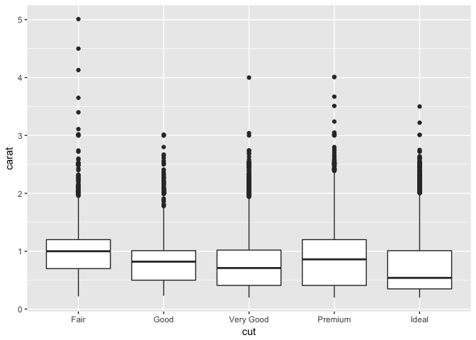

# Benn.5-24


```r
sessionInfo()
```

```
## R version 3.3.2 (2016-10-31)
## Platform: x86_64-apple-darwin13.4.0 (64-bit)
## Running under: OS X El Capitan 10.11.6
## 
## locale:
## [1] en_US.UTF-8/en_US.UTF-8/en_US.UTF-8/C/en_US.UTF-8/en_US.UTF-8
## 
## attached base packages:
## [1] stats     graphics  grDevices utils     datasets  methods   base     
## 
## loaded via a namespace (and not attached):
##  [1] backports_1.0.5 magrittr_1.5    rprojroot_1.2   tools_3.3.2    
##  [5] htmltools_0.3.6 yaml_2.1.14     Rcpp_0.12.10    stringi_1.1.5  
##  [9] rmarkdown_1.5   knitr_1.15.1    stringr_1.2.0   digest_0.6.12  
## [13] evaluate_0.10
```


```r
library(tidyverse)
```

```
## Loading tidyverse: ggplot2
## Loading tidyverse: tibble
## Loading tidyverse: tidyr
## Loading tidyverse: readr
## Loading tidyverse: purrr
## Loading tidyverse: dplyr
```

```
## Conflicts with tidy packages ----------------------------------------------
```

```
## filter(): dplyr, stats
## lag():    dplyr, stats
```


##7.3.4 Exercises  

**1. Explore the distribution of each of the x, y, and z variables in diamonds. What do you learn? Think about a diamond and how you might decide which dimension is the length, width, and depth.**


```r
diamonds %>% 
  ggplot(mapping = aes(x = x)) + geom_histogram(binwidth = .01)
```

<!-- -->

```r
diamonds %>% 
  ggplot(mapping = aes(x = y)) + geom_histogram(binwidth = .01)
```

<!-- -->

```r
diamonds %>% 
  ggplot(mapping = aes(x = z)) + geom_histogram(binwidth = .01)
```

<!-- -->

Both Y and Z have some significant outliers.


```r
trimmed <- diamonds %>% 
  filter(z < 20 & y < 20)
```


```r
trimmed %>% 
  ggplot(aes(x = x, y = y)) + geom_point()
```

<!-- -->

```r
trimmed %>% 
  ggplot(aes(x = x, y = z)) + geom_point()
```

<!-- -->

```r
trimmed %>% 
  ggplot(aes(x = y, y = z)) + geom_point()
```

<!-- -->

Since diamonds are usually circular or square, the length and width would likely be equal in most cases. Looking at the scatterplots, it seems like x and y are well correlated, so they are likely width and length, while z is the depth.  

**2. Explore the distribution of price. Do you discover anything unusual or surprising? (Hint: Carefully think about the binwidth and make sure you try a wide range of values.)**


```r
diamonds %>% 
  ggplot(mapping = aes(x = price)) + geom_histogram(binwidth = 10)
```

<!-- -->

```r
diamonds %>% 
  ggplot(mapping = aes(x = price)) + geom_histogram(binwidth = 100)
```

<!-- -->

```r
diamonds %>% 
  ggplot(mapping = aes(x = price)) + geom_histogram(binwidth = 1000)
```

<!-- -->

```r
cheap <- diamonds %>% 
  filter(price < 2000)
  ggplot(data = cheap, mapping = aes(x = price)) + geom_histogram(binwidth = 10)
```

<!-- -->
There's a gap at $1500 - perhaps a marketing thing?

**3. How many diamonds are 0.99 carat? How many are 1 carat? What do you think is the cause of the difference?**


```r
counts <- diamonds 
  counts%>% 
  filter(carat == 0.99 | carat == 1.00) %>% 
  ggplot(mapping = aes(x=carat)) + geom_histogram(binwidth = .01)
```

<!-- -->

There are far more 1 carat diamonds - probably a marketing thing. Presumably they try to avoid making diamonds that are close but not quite 1 carat.

**4. Compare and contrast coord_cartesian() vs xlim() or ylim() when zooming in on a histogram. What happens if you leave binwidth unset? What happens if you try and zoom so only half a bar shows?**


```r
counts <- diamonds 
  counts%>% 
  filter(carat == 0.99 | carat == 1.00) %>% 
  ggplot(mapping = aes(x=carat)) + geom_histogram(binwidth = .01) +
  coord_cartesian(ylim = c(0, 100))
```

<!-- -->

```r
counts <- diamonds 
  counts%>% 
  filter(carat == 0.99 | carat == 1.00) %>% 
  ggplot(mapping = aes(x=carat)) + geom_histogram(binwidth = .01) +
  ylim(0, 100)
```

```
## Warning: Removed 1 rows containing missing values (geom_bar).
```

<!-- -->

using ylim drops bars that go above the limit!

##7.4.1

**1. What happens to missing values in a histogram? What happens to missing values in a bar chart? Why is there a difference?**


```r
diamonds2 <- diamonds
  diamonds2 %>% 
  mutate(y = ifelse(y < 5 | y > 20, NA, y)) %>% 
  ggplot(mapping = aes(x= y)) + geom_histogram(binwidth = .1)
```

```
## Warning: Removed 17573 rows containing non-finite values (stat_bin).
```

<!-- -->

In histogram, missing values are removed.

```r
diamonds3 <- diamonds
  diamonds3 %>% 
  mutate(color = ifelse(color == "E", NA, color)) %>% 
  ggplot(mapping = aes(x= color)) + geom_bar()
```

```
## Warning: Removed 9797 rows containing non-finite values (stat_count).
```

<!-- -->

In barcharts, the values are removed, but it also messes up the axis labels.

**2. What does Na.rm do in mean() and sum()?**  

Na.rm removes NAs and allows the calculation to proceed.

##7.5.1.1 Exercises  

**1. Use what you’ve learned to improve the visualisation of the departure times of cancelled vs. non-cancelled flights.**


```r
library(nycflights13)
```

```r
flights %>% 
  mutate(status =  ifelse(is.na(arr_delay),"cancelled","not_cancelled")) %>% 
  select(sched_dep_time, arr_delay, status) %>% 
  ggplot(aes(x = sched_dep_time, y = ..density.., color = status)) + geom_freqpoly()
```

```
## `stat_bin()` using `bins = 30`. Pick better value with `binwidth`.
```

<!-- -->

**2. What variable in the diamonds dataset is most important for predicting the price of a diamond? How is that variable correlated with cut? Why does the combination of those two relationships lead to lower quality diamonds being more expensive?**


```r
diamonds %>%
  ggplot(aes(x = carat, y = price, color = cut)) + geom_point()
```

<!-- -->

```r
diamonds %>% 
  ggplot(aes(x = cut, y = carat)) + geom_boxplot()
```

<!-- -->

The largest diamonds tend to be of lower quality cuts.

**3. Install the ggstance package, and create a horizontal boxplot. How does this compare to using coord_flip()?**


```r
library(ggstance)
```

```
## 
## Attaching package: 'ggstance'
```

```
## The following objects are masked from 'package:ggplot2':
## 
##     geom_errorbarh, GeomErrorbarh
```

```r
diamonds %>% 
  ggplot(aes(x = cut, y = carat)) + geom_boxplot() + coord_flip()
```

<!-- -->

```r
diamonds %>% 
  ggplot(mapping = aes(x = carat, y = cut)) + geom_boxploth()
```

<!-- -->

They seem to be the same - the boxploth command is slightly simpler.

**4. One problem with boxplots is that they were developed in an era of much smaller datasets and tend to display a prohibitively large number of “outlying values”. One approach to remedy this problem is the letter value plot. Install the lvplot package, and try using geom_lv() to display the distribution of price vs cut. What do you learn? How do you interpret the plots?**

This resulted in an error message when I tried to load the lvplot library.

**5. Compare and contrast geom_violin() with a facetted geom_histogram(), or a coloured geom_freqpoly(). What are the pros and cons of each method?**


```r
diamonds %>% 
  ggplot(aes(x = cut, y = carat)) + geom_violin()
```

<!-- -->


```r
diamonds %>%
  ggplot(aes(x = carat)) + geom_histogram() + facet_grid(.~cut)
```

```
## `stat_bin()` using `bins = 30`. Pick better value with `binwidth`.
```

<!-- -->


```r
diamonds %>%
  ggplot(aes(x = carat, color = cut)) + geom_freqpoly()
```

```
## `stat_bin()` using `bins = 30`. Pick better value with `binwidth`.
```

<!-- -->

The violin and faceted plots are both nice - they let you see the distribution. The faceted plot give you a better idea of the relative abundance though.


