# R-club-May-3.Benn


```r
library(tidyverse)
```

```
## Loading tidyverse: ggplot2
## Loading tidyverse: tibble
## Loading tidyverse: tidyr
## Loading tidyverse: readr
## Loading tidyverse: purrr
## Loading tidyverse: dplyr
```

```
## Conflicts with tidy packages ----------------------------------------------
```

```
## filter(): dplyr, stats
## lag():    dplyr, stats
```


```r
sessionInfo()
```

```
## R version 3.3.2 (2016-10-31)
## Platform: x86_64-apple-darwin13.4.0 (64-bit)
## Running under: OS X El Capitan 10.11.6
## 
## locale:
## [1] en_US.UTF-8/en_US.UTF-8/en_US.UTF-8/C/en_US.UTF-8/en_US.UTF-8
## 
## attached base packages:
## [1] stats     graphics  grDevices utils     datasets  methods   base     
## 
## other attached packages:
## [1] dplyr_0.5.0     purrr_0.2.2     readr_1.1.0     tidyr_0.6.1    
## [5] tibble_1.3.0    ggplot2_2.2.1   tidyverse_1.1.1
## 
## loaded via a namespace (and not attached):
##  [1] Rcpp_0.12.10     cellranger_1.1.0 plyr_1.8.4       forcats_0.2.0   
##  [5] tools_3.3.2      digest_0.6.12    jsonlite_1.4     lubridate_1.6.0 
##  [9] evaluate_0.10    nlme_3.1-131     gtable_0.2.0     lattice_0.20-35 
## [13] psych_1.7.5      DBI_0.6-1        yaml_2.1.14      parallel_3.3.2  
## [17] haven_1.0.0      xml2_1.1.1       stringr_1.2.0    httr_1.2.1      
## [21] knitr_1.15.1     hms_0.3          rprojroot_1.2    grid_3.3.2      
## [25] R6_2.2.0         readxl_1.0.0     foreign_0.8-68   rmarkdown_1.5   
## [29] modelr_0.1.0     reshape2_1.4.2   magrittr_1.5     backports_1.0.5 
## [33] scales_0.4.1     htmltools_0.3.6  rvest_0.3.2      assertthat_0.2.0
## [37] mnormt_1.5-5     colorspace_1.3-2 stringi_1.1.5    lazyeval_0.2.0  
## [41] munsell_0.4.3    broom_0.4.2
```

##3.6.1 Exercises  

**1. What geom would you use to draw a line chart? A boxplot? A histogram? An area chart?**
geom_line(), geom_boxplot(), geom_histogram(), geom_area().

**2. Run this code in your head and predict what the output will look like. Then, run the code in R and check your predictions.**  

This will produce a scatterplot of displacement by highway mileage, with points colored based on drivetrain. There will also be a trendline with no standard error bars.


```r
ggplot(data = mpg, mapping = aes(x = displ, y = hwy, color = drv)) + 
  geom_point() + 
  geom_smooth(se = FALSE)
```

```
## `geom_smooth()` using method = 'loess'
```

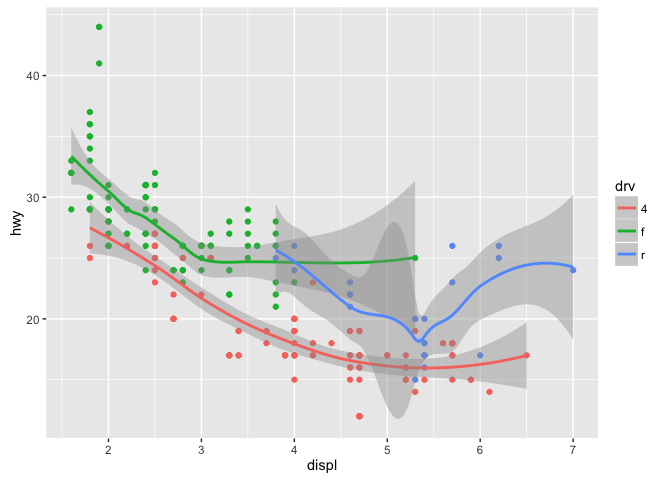<!-- -->

So I was not quite correct. The trendlines also follow the color aes, so there are 3 lines.

**3. What does show.legend = FALSE do? What happens if you remove it? Why do you think I used it earlier in the chapter?**  

It hides the legend. This keeps the graph looking cleaner if there are many categories.


```r
ggplot(data = mpg, mapping = aes(x = displ, y = hwy, color = drv)) + 
  geom_point(show.legend = FALSE) + 
  geom_smooth(se = TRUE)
```

```
## `geom_smooth()` using method = 'loess'
```

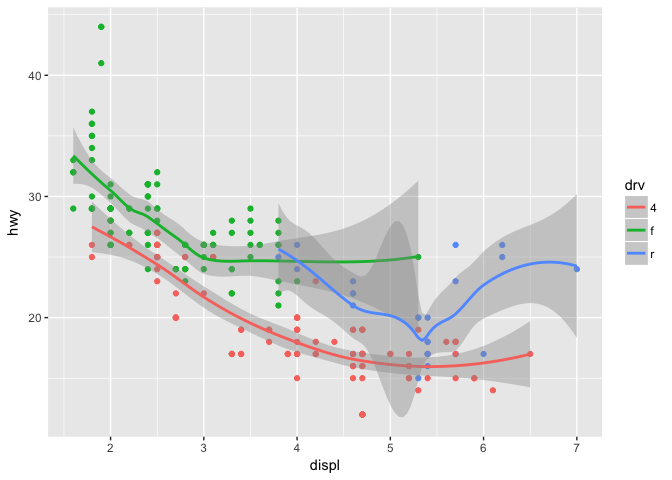<!-- -->

Not clear on this one.

**4. What does the se argument to geom_smooth() do?**
It generates standard errors around the trendlines.

**5. Will these two graphs look different? Why/why not?**
The graphs should look the same - they do the mapping, just in different places.

**6. Generate R code to recreate graphs.**

```r
ggplot(data = mpg, mapping = aes(x = displ, y = hwy)) + 
  geom_point() + 
  geom_smooth(se = FALSE)
```

```
## `geom_smooth()` using method = 'loess'
```

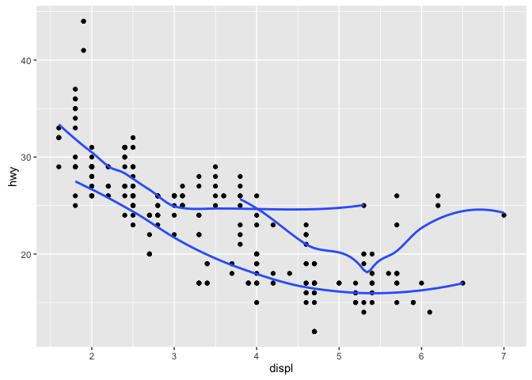<!-- -->

```r
ggplot(data = mpg, mapping = aes(x = displ, y = hwy)) + 
  geom_point() + 
  geom_smooth(mapping = aes(x = displ, y = hwy, group = drv), se = FALSE)
```

```
## `geom_smooth()` using method = 'loess'
```

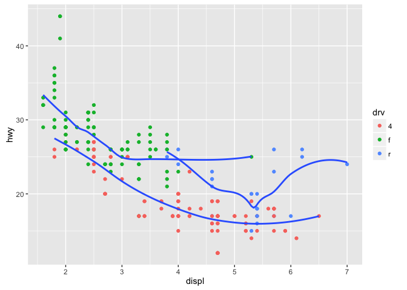<!-- -->

```r
ggplot(data = mpg) + 
  geom_point(mapping = aes(x = displ, y = hwy, color = drv)) + 
  geom_smooth(mapping = aes(x = displ, y = hwy, group = drv), se = FALSE)
```

```
## `geom_smooth()` using method = 'loess'
```

<!-- -->

```r
ggplot(data = mpg) + 
  geom_point(mapping = aes(x = displ, y = hwy, color = drv)) + 
  geom_smooth(mapping = aes(x = displ, y = hwy), se = FALSE)
```

```
## `geom_smooth()` using method = 'loess'
```

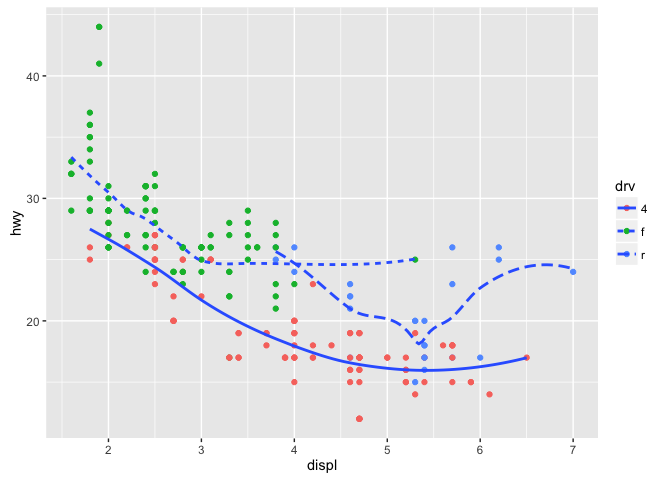<!-- -->

```r
ggplot(data = mpg) + 
  geom_point(mapping = aes(x = displ, y = hwy, color = drv)) + 
  geom_smooth(mapping = aes(x = displ, y = hwy, linetype = drv), se = FALSE)
```

```
## `geom_smooth()` using method = 'loess'
```

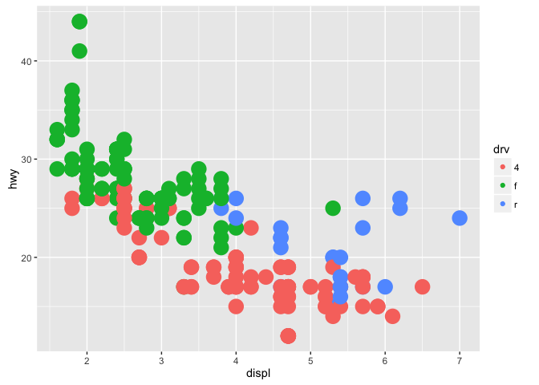<!-- -->

```r
ggplot() + 
  geom_point(data = mpg, mapping = aes(x = displ, y = hwy, color = drv, stroke = 4))
```

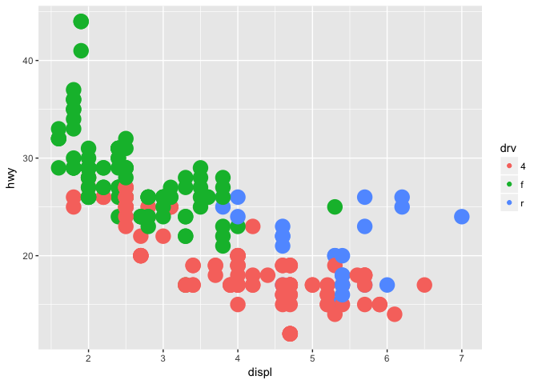<!-- -->

##3.7.1 Exercises
**1. What is the default geom associated with stat_summary()? How could you rewrite the previous plot to use that geom function instead of the stat function?**
Stat_summary is associated with geom_histogram and geom_freqpoly.


```r
ggplot(data=mpg) +
  geom_histogram(mapping = aes(x=hwy),binwidth = 5)
```

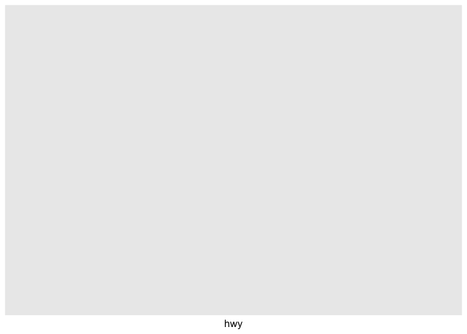<!-- -->

**couldn't figure out how to duplicate the above with stat_summary()**

```r
ggplot(data=mpg) +
  stat_summary(fun.y = "count", mapping = aes(hwy))
```

```
## Error: stat_summary requires the following missing aesthetics: y
```

<!-- -->

**couldn't figure out how to duplicate the stat_summary thing with either of the associated geoms**

```r
ggplot(data = diamonds) + 
  geom_pointrange(mapping = aes(x = cut), fun.y = median, fun.ymin = min, fun.ymax = max, fun.y = median)
```

```
## Warning: The plyr::rename operation has created duplicates for the
## following name(s): (`fun.y`)
```

```
## Warning: Ignoring unknown parameters: fun.y, fun.ymin, fun.ymax
```

```
## Error: geom_pointrange requires the following missing aesthetics: y, ymin, ymax
```

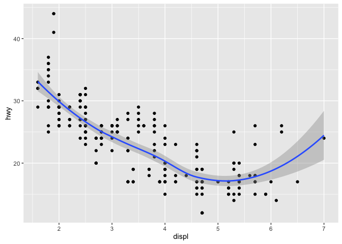<!-- -->

**2. What does geom_col() do? How is it different to geom_bar()?**
geom_col() doesn't seem to exist in my version of R.

**3. Most geoms and stats come in pairs that are almost always used in concert. Read through the documentation and make a list of all the pairs. What do they have in common?**

geom_boxplot - stat_boxplot
geom_bar - stat_count
geom_point - stat = "identity"
geom_errorbar - stat = "identity"

I'm not sure what the last part of the question is getting at.

**4. What variables does stat_smooth() compute? What parameters control its behaviour?**

```r
ggplot(mpg, aes(displ, hwy)) +
  geom_point() +
  geom_smooth()
```

```
## `geom_smooth()` using method = 'loess'
```

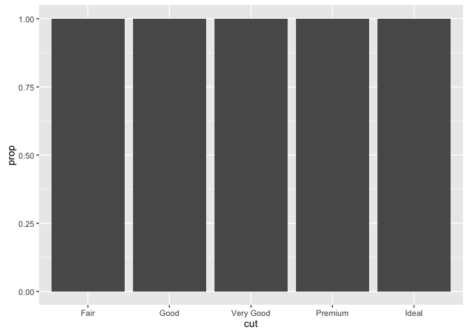<!-- -->
smooth() plots a trendline and produces error bars. It takes input in terms of the method - either a formula or a method.

**5. In our proportion bar chart, we need to set group = 1. Why? In other words what is the problem with these two graphs?**  


```r
ggplot(data = diamonds) + 
  geom_bar(mapping = aes(x = cut, y = ..prop..))
```

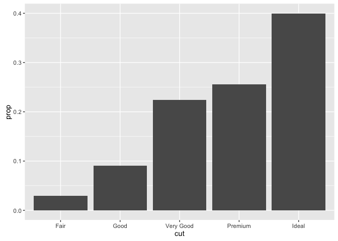<!-- -->


```r
ggplot(data = diamonds) + 
  geom_bar(mapping = aes(x = cut, y = ..prop.., group = 1))
```

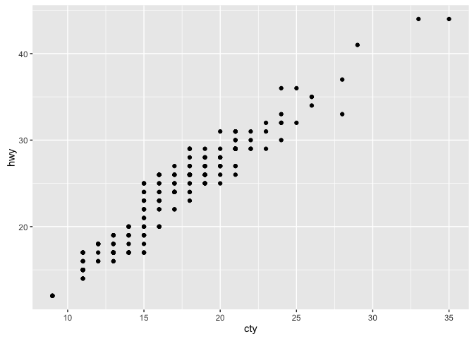<!-- -->

It looks like without group, it's calculating proportions within each diamond grade.

##3.8.1 Exercises

**1. What is the problem with this plot? How could you improve it?**

```r
ggplot(data = mpg, mapping = aes(x = cty, y = hwy)) + 
  geom_point()
```

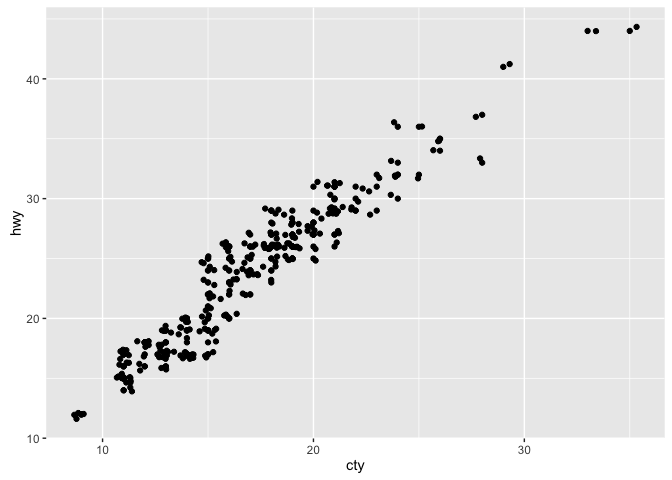<!-- -->

I'm guessing it's omitting points.

```r
ggplot(data = mpg, mapping = aes(x = cty, y = hwy)) + 
  geom_point() +
  geom_jitter()
```

<!-- -->

**2. What parameters to geom_jitter() control the amount of jittering?**
width and height control the amount of jittering.

**3. Compare and contrast geom_jitter() with geom_count().**

```r
ggplot(data = mpg, mapping = aes(x = cty, y = hwy)) + 
  geom_point() +
  geom_count()
```

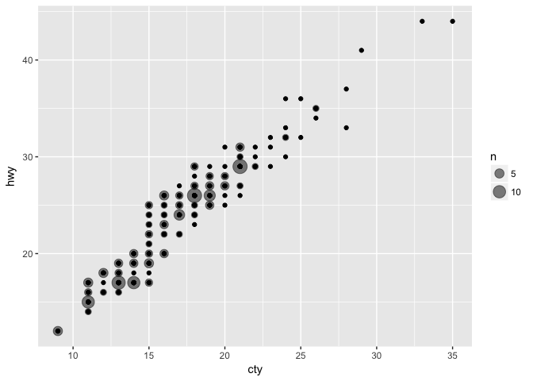<!-- -->

jitter shifts points slightly to prevent overplotting, while count increases point size when there are multiple points at a particular coordinate.

**4. What’s the default position adjustment for geom_boxplot()? Create a visualisation of the mpg dataset that demonstrates it.**
The default is dodge.

```r
ggplot(data = mpg, mapping = aes(x = drv, y = hwy, fill = manufacturer)) + 
  geom_boxplot(position = position_dodge(1))
```

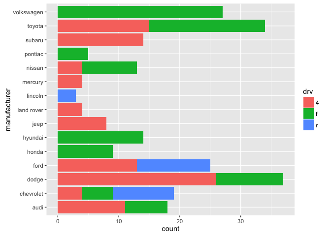<!-- -->

##3.9.1 Exercises

**1. Turn a stacked bar chart into a pie chart using coord_polar().**

```r
x <- ggplot(data = mpg) + geom_bar(mapping = aes(x = manufacturer, fill = drv))
x + coord_flip()
```

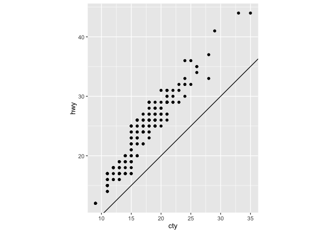<!-- -->

```r
x + coord_polar()
```

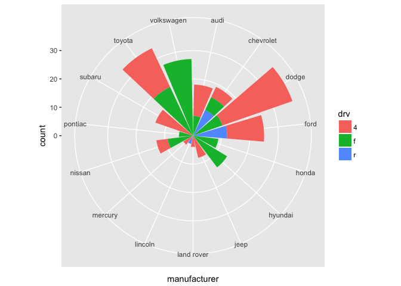<!-- -->

**2. labs()?**
Allows you to specify labels.

**3. coord_quickmap vs coord_map**
Quickmap makes a simplified projection that runs faster, but is less accurate.

**4. What does the plot below tell you about the relationship between city and highway mpg? Why is coord_fixed() important? What does geom_abline() do?**
This tells us that city and hwy mpg are correlated.

```r
ggplot(data = mpg, mapping = aes(x = cty, y = hwy)) +
  geom_point() + 
  geom_abline() +
  coord_fixed()
```

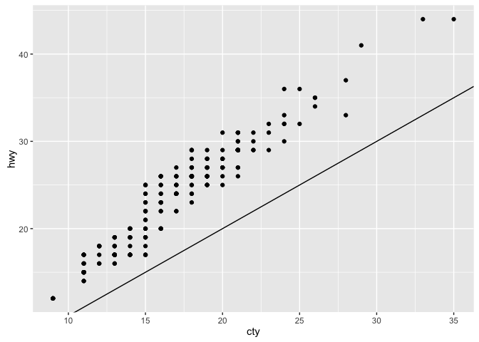<!-- -->

```r
ggplot(data = mpg, mapping = aes(x = cty, y = hwy)) +
  geom_point() + 
  geom_abline()
```

<!-- -->

I can't tell the difference when coord_fixed() is removed - the scales stay the same, though the proportions are different. Not sure why this is significant.
I'm also not clear on what abline is doing - it's clearly drawing a line, but I'm not sure what the defaults are for setting the slope and intercept.

##4.4 Practice
**1. Why does this code not work?**
my_variable is mispelled in line 2- there's a 1 instead of an i.

**2. Tweak each of the following R commands so that they run correctly:**


```r
ggplot(data = mpg) + 
  geom_point(mapping = aes(x = displ, y = hwy))
```

<!-- -->


```r
filter(mpg, cyl == 8)
```

```
## # A tibble: 70 × 11
##    manufacturer              model displ  year   cyl      trans   drv
##           <chr>              <chr> <dbl> <int> <int>      <chr> <chr>
## 1          audi         a6 quattro   4.2  2008     8   auto(s6)     4
## 2     chevrolet c1500 suburban 2wd   5.3  2008     8   auto(l4)     r
## 3     chevrolet c1500 suburban 2wd   5.3  2008     8   auto(l4)     r
## 4     chevrolet c1500 suburban 2wd   5.3  2008     8   auto(l4)     r
## 5     chevrolet c1500 suburban 2wd   5.7  1999     8   auto(l4)     r
## 6     chevrolet c1500 suburban 2wd   6.0  2008     8   auto(l4)     r
## 7     chevrolet           corvette   5.7  1999     8 manual(m6)     r
## 8     chevrolet           corvette   5.7  1999     8   auto(l4)     r
## 9     chevrolet           corvette   6.2  2008     8 manual(m6)     r
## 10    chevrolet           corvette   6.2  2008     8   auto(s6)     r
## # ... with 60 more rows, and 4 more variables: cty <int>, hwy <int>,
## #   fl <chr>, class <chr>
```

**4. alt+shift+k**
This brings up keyboard shortcuts. This can also be accessed via the help menu.

**graph my own data!**


```r
setwd("~/Box Sync/BIS2C/2C Analysis/App evaluation")
practical <- read.delim("F16.lab.practical.txt",header = T)
ggplot(practical, aes(x=MT.Letter,y=Practical.Live.Plants)) + 
  geom_boxplot(aes(fill=App.completion))+
  ggtitle("Performance on Questions Requiring Live Plant ID")+ 
  labs(x="Midterm Letter Grade", y="Live Plant Questions Score")
```

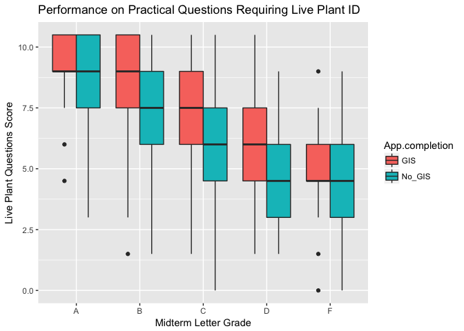<!-- -->
